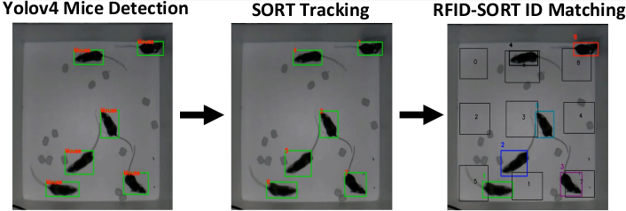
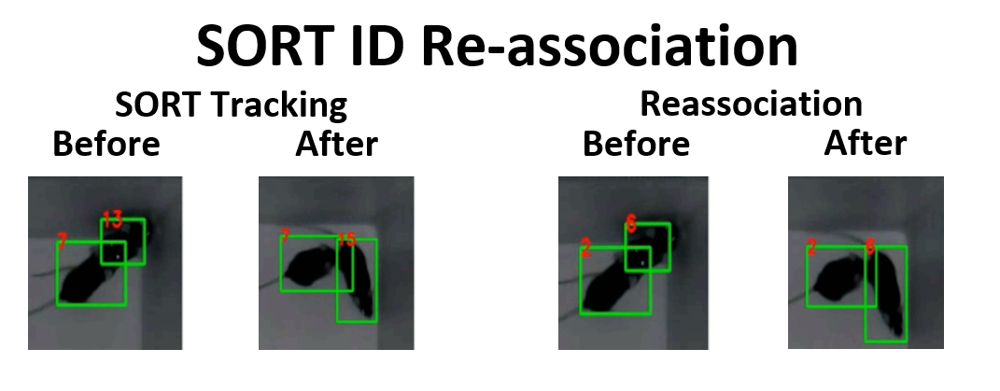
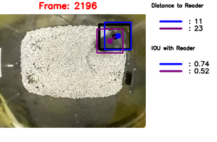
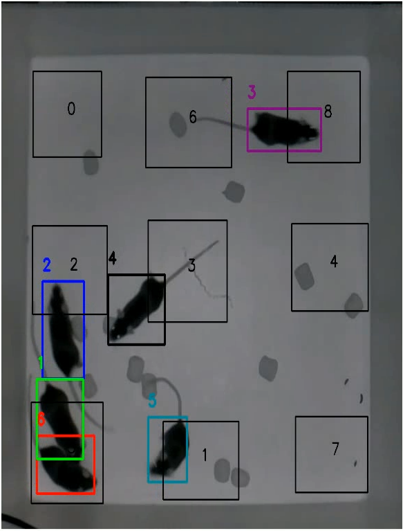
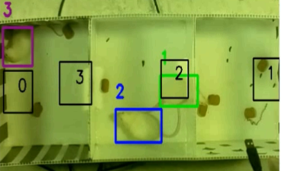
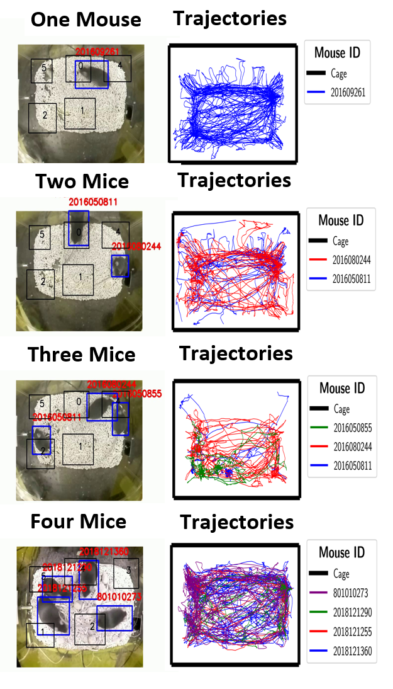

# PyMouseTracks(PMT)
- A integration of Yolov4-tf2, SORT, RFID detections tracking mice
- To analyze data generated from [PSYCO recording software on raspnberry pi](https://github.com/tf4ong/tracker_rpi)
- Data analyzed offline using a pc/cloud notebook with cuda capable GPU

#### Analytical Codes and Modules
##### An Overview of the Tracking Process

##### Yolov4-tensorflow2 
yolov3-tf2:forked from [the AI guys GitHub Page](https://github.com/theAIGuysCode/tensorflow-yolov4-tflite)
- A tensorflow2 implementation of yolov4 which is easy to install and use
- Can be cloned and directly used on Anaconda or on Google Colab with GPU turned on 
- Simple object recognition module for detecting mice
- Orginal implmentation in darknet can be found at [AlexeyAB GitHub Page](https://github.com/AlexeyAB/darknet)
- Three weight included as of the current release
- Weights are adviced to be trained on the original darknet implementation
- The AI guys has provided an excellent [tutorial](https://www.youtube.com/watch?v=mmj3nxGT2YQ) to train weights in darknet using google colab.
##### SORT 
SORT: forcked from [abewly GitHub Page](https://github.com/abewley/sort)
- A simple online and realtime tracking algorithm for 2D multiple object tracking in video sequences.
- Implements a visual multiple object tracking framework based on 
rudimentary data association and state estimation techniques. 
- Produces object identities on the fly and tracks them 
- Initiatially described in [this paper](https://arxiv.org/abs/1602.00763)
- Greatly depends on detection quality
- Maintains tracking throughout occlusions and clustering
- Also used to generated Kalmen filter predictions of mice locations when occuluded/clustered

###### SORT Track Identity Reassociation: A Euclidean Distance Method
SORT was orignally designed for tracking objects moving in and out of frames at relatively uniform speed.
Mice movements are often fast changing, therefore SORT often produces new identities for the same mouse.

###### Home Cage Tracking
Taking advantage of known number of mice detected in the previous frames and that a new mouse can only enter/exist at a designated location (Entrance), we can therfore reassign new false positive identities to real identities generated. Here, a centroid tracking algorithm based on Euclidean distances along with the Hungarian algorithm  employed. 
###### Open-field (No Entrance)
In any given scenario, the number of mice in a cage is constant. Therefore, any new false positive identities can then be reassigned to its original true positive identity. Similar to the home-cage, we also employed a centroid tracking algorithm based on Euclidean distances along with the Hungarian algorithm

A tutorial of centroid tracking can be found 
[here](https://www.pyimagesearch.com/2018/07/23/simple-object-tracking-with-opencv/)

#### RFID_Matching 
Customed writted script for RFID reading to SORT ID association
- When a tag is read, the closest detected mice (linear distance) with the the higest IOU with the reader is matched

  

- To ensure a clean read and RFID match, if there is 2 or more mice within a certain distance or have a certain IOU with the reader,
no match would be made

  

- The SORT ID that is matched will be associated with the tag throughout the video

###### RFID Vertification and ongoing Corection  
- To ensure continous accuracy in the RFID-SORT ID matches, an ongoing vertification of the match occurs when the tag is read
- If the tag read does not match the SORT ID associated, the a correction mechanism occurs.
- During the correction, the original (incorrect) RFID-SORT ID match is removed and replaced with the correct RFID match until a point where the mice had a possible occulusion with other mice based on a defined IOU threshold. In the case of the home-cage, the threshold distance to the entrance would also be considered as a point of occulusion.

##### Tracking in Different Environments and Rodent Strains
Increase arena size and RFID readers connected to track more mice. The limit is the sky!
##### OpenField

##### White Mice in 3 Chamber Arena (White Background) 

##### Custom Home Cage Tracking

#Please lookforward to our next update to using [Yolov7](https://github.com/WongKinYiu/yolov7)
#The update will enable trainning to done fully in python. 

For full videos, please access the following [Link](https://youtube.com/playlist?list=PLmcjDqLt_Xk6AAlll3ztvgNI9P3yQxPc2) on youtube.

For detailed setup/use guide, please refer to the PyMouseTracks Setup_Use Guide pdf in the current repository.
Trainning can be done on the cloud (please refer to the notebooks folder) or using docker. 
To pull docker image, enter the following command: docker pull tf4ong/darknet:latest.

###Sample Weights and data can be found at [osf](https://osf.io/78akz/)
